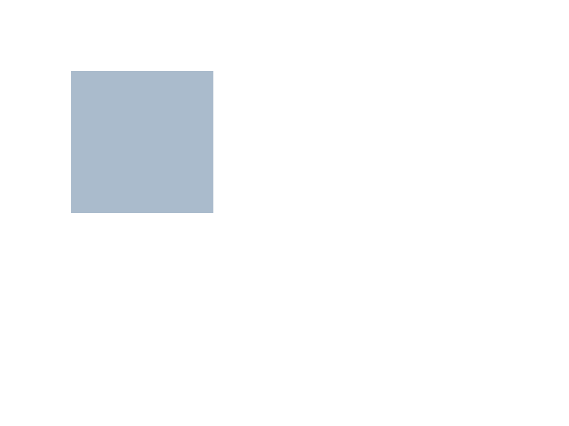
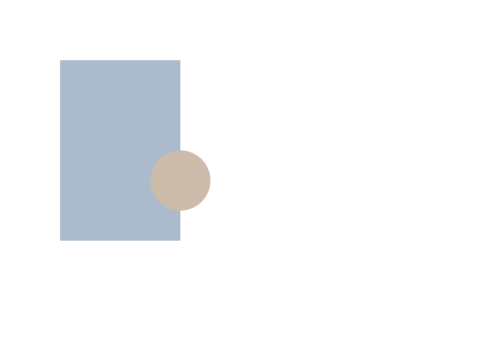
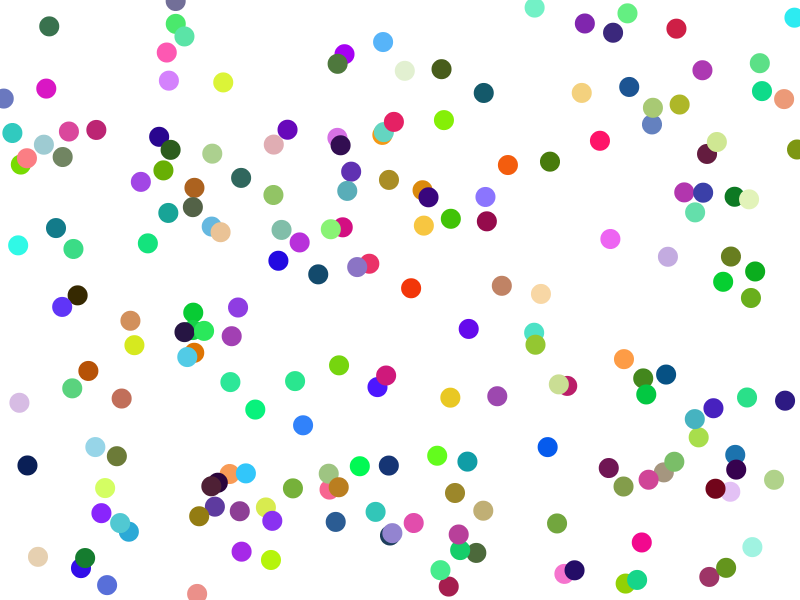

# TypeScript速習会
# @Wantedly

Nov. 20, 2015  
[@seanchas_t](http://seanchas116.github.io/)

---

## 今日紹介すること

* 基本的なTypeScriptのコードを書く方法
* TypeScriptプロジェクトのセットアップ方法
* 既存のJavaScriptと組み合わせる

---

# 早速書いてみよう!

---

## 今日書く内容

Canvas要素を使ったお絵かきをTypeScriptで

---

## サンプルプロジェクト

https://github.com/seanchas116/learn-typescript

分からなくなったら見てください

---

## エディタ

* Atom + atom-typescript

---

# TypeScriptの紹介

---

## TypeScriptの紹介

* JavaScript + 静的型
  * 基本的には JavaScript の上位互換

---

# セットアップ

---

## 今回のプロジェクト構成

### TypeScript ファイル (.ts)

↓ TypeScriptコンパイラ (tsc)

### JavaScript ファイル (.js)

↓ Browserify (watchify)

### bundle.js

---

## package.json

```
mkdir learn-typescript && cd learn-typescript
npm init
npm install --save-dev typescript
npm install --save-dev watchify
```

---

## tsconfig.json

TypeScriptのプロジェクト管理に使われるファイル

```json
{
    "compilerOptions": {
        "target": "es5",
        "module": "commonjs",
        "moduleResolution": "node",
        "noImplicitAny": true,
        "inlineSourceMap": true,
        "inlineSources": true
    },
    "files": [
    ]
}
```

---

## tsconfig.json

atom-typescriptを使う人はさらに

```json
  ...
  "filesGlob": [
      "**/*.ts",
      "!node_modules/**"
  ],
  "compileOnSave": false,
  "atom": {
      "rewriteTsconfig": true
  }
}
```

---

## ビルドタスク

package.json の scripts フィールドを使う  
`npm run ...` で実行

```json
{
  ...
  "scripts": {
    "tsc": "tsc -w",
    "watchify": "watchify -d src/index.js -o bundle.js"
  },
  ...
}

```

package.json

---

## ビルドタスク

* `npm run tsc` (`tsc -w`)
  * TypeScriptを監視してコンパイル
* `npm run watchify` (`watchify -d src/index.js -o bundle.js`)
  * Browserify (watchify で監視してバンドル)

---

## index.html

```html
<!DOCTYPE html>
<html>
  <head>
    <title>TypeScript Canvas</title>
  </head>
  <body>
  </body>
  <script src="bundle.js"></script>
</html>
```

---

## まとめ

* `package.json`
  * 全般的プロジェクト設定
  * 依存パッケージ設定
  * ビルドタスク設定
* `tsconfig.json`
  * TypeScriptのプロジェクト設定
* `index.html`
  * ブラウザでロードするHTML

---

# コードを書こう

---

## 簡単な描画

```ts
const canvas = document.createElement("canvas");
canvas.width = 800;
canvas.height = 600;
document.body.appendChild(canvas);

const ctx = canvas.getContext("2d");

ctx.beginPath();
ctx.fillStyle = "#abc";
ctx.rect(100, 100, 200, 200);
ctx.fill();
```

src/index.ts

---

## tsconfig.jsonに追加

```json
  "files": [
    "src/index.ts"
  ]
```

atom-typescript だと自動で追加してくれます

---

## コンパイル

* `npm run tsc`
* `npm run watchify`
* index.htmlを開く

---

## 描画結果



---

## JavaScript (ES6) とおなじ?

```ts
const canvas = document.createElement("canvas");
canvas.width = 800;
canvas.height = 600;
document.body.appendChild(canvas);

const ctx = canvas.getContext("2d");

ctx.beginPath();
ctx.fillStyle = "#abc";
ctx.rect(100, 100, 200, 200);
ctx.fill();
```

---

## 型はちゃんとついている (型推論)

```ts
const canvas = document.createElement("canvas");
```

canvas: [HTMLCanvasElement](https://developer.mozilla.org/ja/docs/Web/API/HTMLCanvasElement)

```ts
const ctx = canvas.getContext("2d");
```
ctx: [CanvasRenderingContext2D](https://developer.mozilla.org/ja/docs/Web/API/CanvasRenderingContext2D)

---

## 変なメソッド呼び出しをすると…

```ts
ctx.wrongMethod(1, 2, 3);
```

```
error TS2339: Property 'wrongMethod' does not exist
on type 'CanvasRenderingContext2D'.
```

---

# interface

---

```ts
interface Path {
  x: number;
  y: number;
  draw(ctx: CanvasRenderingContext2D): void;
}
export = Path;
```

src/Path.ts

---

## tsconfig.jsonに追加

```json
  "files": [
    "src/index.ts",
    "src/Path.ts",
  ]
```

---

```ts
import Path = require("./Path");

function fillPath(color: string, path: Path) {
  ctx.beginPath();
  ctx.fillStyle = color;
  path.draw(ctx);
  ctx.fill();
}

const rect = {
  x: 100, y: 200, w: 100, h: 100,
  draw(ctx: CanvasRenderingContext2D) {
    ctx.rect(this.x, this.y, this.w, this.h);
  }
};

fillPath("#abc", rect);
```

src/index.ts

---


---

## TypeScript の型とは?

TypeScript の型の基本は `interface`

`interface`: **必要なプロパティ(メソッド)の集合**

`interface`の条件を満たすと代入が成功する  
(ダックタイピング / 構造的部分型)

---

## TypeScript のモジュール管理

* **ES6 スタイル** (新しい)
  * ES6 のモジュール構文を使う
* **Import Require** (昔からある)
  * CommonJS風モジュール構文
  * `import Foo = require("./Foo")`
  * `export = Foo`
  * 今回はこちらを使用

---

## TypeScript のモジュール:
## どちらを使う?

Import Require のほうが今のところ安心
  * 古くからある型定義ファイルは  
    こちらを前提にしている
  * ES6 スタイル と Import Require の互換性が低い
    * 今後改善される可能性あり

---

## tsconfig.json 設定

```json
  "compilerOptions": {
    "target": "es5",
    "module": "commonjs",
    ...
  }
```

* `"module": "commonjs"`
  * Import Require を使う -> CommonJS へコンパイルするよう設定
*  `"target": "es6"` で `"module"` を指定しない
  * ES6 スタイルになる

---

# class

---

```
class Circle {
  constructor(public x: number, public y: number, public r: number) {}
  draw(ctx: CanvasRenderingContext2D) {
    ctx.arc(this.x, this.y, this.r, 0, Math.PI * 2, true);
  }
  static unit() {
    return new Circle(0, 0, 1);
  }
}
export = Circle;
```

src/Circle.ts

---

```
class Rectangle {
  constructor(public x: number, public y: number, public w: number, public h: number) {}

  draw(ctx: CanvasRenderingContext2D) {
    ctx.rect(this.x, this.y, this.w, this.h);
  }
}
export = Rectangle;
```

src/Rectangle.ts

---

```ts
const rect = new Rectangle(100, 100, 200, 300);
const circle = new Circle(300, 300, 50);
fillPath("#abc", rect);
fillPath("#cba", circle);
```

src/index.ts

---



---

# JavaScript
# ライブラリを使う

---

## 例: ランダムな色をつくりたい

[lodash](https://lodash.com/)を使って

```ts
function randomColor() {
  return "#" + _.sample("0123456789ABCDEF".split(""), 6).join("");
}
```

---

## やり方1: JavaScript の require

```ts
// require() 関数の型定義
declare function require(module: string): any;

const _ = require("lodash");
// _: any (制約のない型)

function randomColor(): string {
  // anyなのでどんなメソッドも呼べる
  return "#" + _.sample("0123456789ABCDEF".split(""), 6).join("");
}
```

JavaScript (CommonJS) の require を直接使う

ライブラリは `any` 型で扱う

---

## やり方2: 自分で型情報を書く

```ts
const _: LodashStatic = require("lodash");

declare function require(module: string): any;

interface LodashStatic {
  sample<T>(array: T[], count: number): T[];
}

function randomColor() {
  // 型チェックされてOK
  return "#" + _.sample("0123456789ABCDEF".split(""), 6).join("");
}
```

interface を使って自分で型情報を書く

---

## やり方3(本命): DefinitelyTyped

```ts
import _ = require("lodash");

function randomColor() {
  return "#" + _.sample("0123456789ABCDEF".split(""), 6).join("");
}
```

import require 構文で lodash を require

**型定義が別に必要**

型定義が集まっているリポジトリ [DefinitelyTyped](https://github.com/DefinitelyTyped/DefinitelyTyped)

---

## tsd

型情報管理ツール [tsd](https://github.com/DefinitelyTyped/tsd) を使う

```
npm install tsd -g
tsd init # tsd.json 作成
tsd install lodash --save
```

```
typings
├── lodash
│   └── lodash.d.ts
└── tsd.d.ts
tsd.json
```

DefinitelyTyped から型情報を取ってきて管理する

---

## lodash.d.ts

```ts
declare var _: _.LoDashStatic;

declare module _ {
  interface LoDashStatic {
    sample<T>(collection: Array<T>, n: number): T[];
    ...
  }
}

declare module "lodash" {
  export = _;
}
```

---

## 実はstringも使える

```ts
import _ = require("lodash");

function randomColor() {
  return "#" + _.sample("0123456789ABCDEF", 6).join("");
}
```

```ts
declare module _ {
  interface List<T> {
    [index: number]: T;
    length: number;
  }
  interface LoDashStatic {
    sample<T>(collection: List<T>, n: number): T[];
    ...
  }
}
```

`string`は`List<T>`を満たすので、  
`_.sample`に`string`も渡せる

---

## 実際に使ってみる

```ts
function randomColor() {
  return "#" + _.sample("0123456789ABCDEF", 6).join("");
}

const circles  = _.times(200, () => ({
  fill: randomColor(),
  path: new Circle(Math.random() * 800, Math.random() * 600, 10)
}));

for (const {fill, path} of circles) {
  fillPath(fill, path);
}
```

src/index.ts

---


